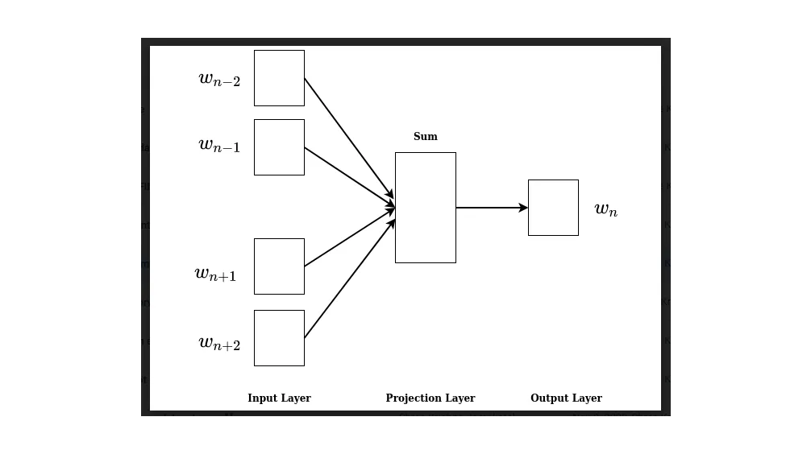

## word2vec

word2vec is a method to represent how each word is related to other words.

It is a neural network that learns the relationships of words given a corpus. It is a method based on inference.

Let there be a sentence like below.

- you ? goodbye and I say hello.

We want to predict the word that goes into the blank: ?.

The simplist way is to predict the blank only with the neighboring words. 
"you" and "goodbye" in this case. These neighboring words are called as "context".

### CBOW (Continuous Bag Of Words)

Continuous bag of words is a neural network model under wond2vec. It takes one-hot encoded corpus as an input and has a hidden layer, produces one-hot encoded vector as an output.

<!--  This is how to make comment in HTML -->

This diagram shows the structure of CBOW. $E = mc^2$
